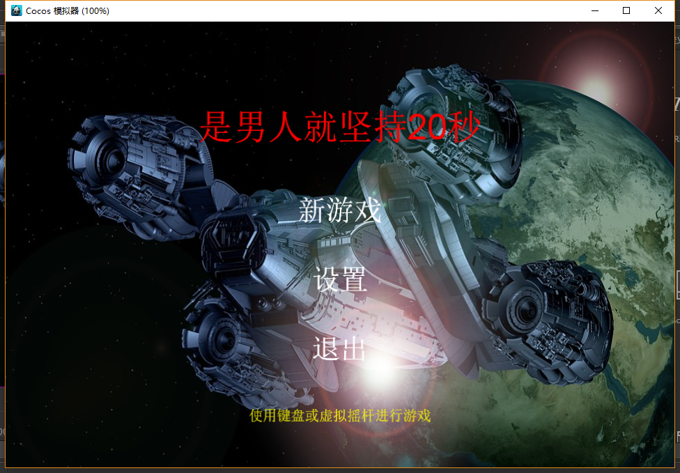
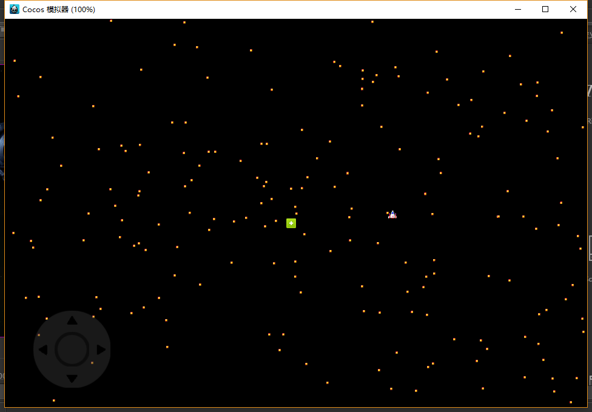
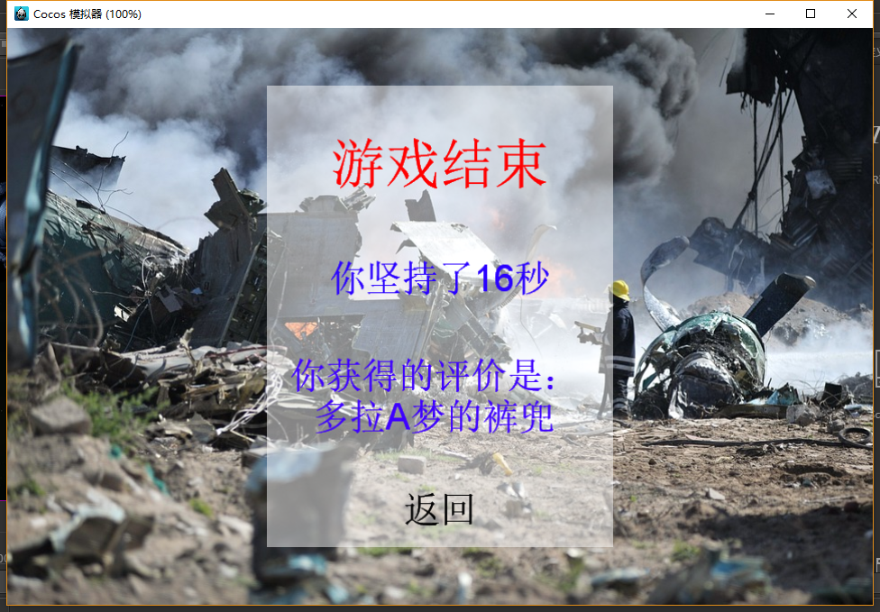
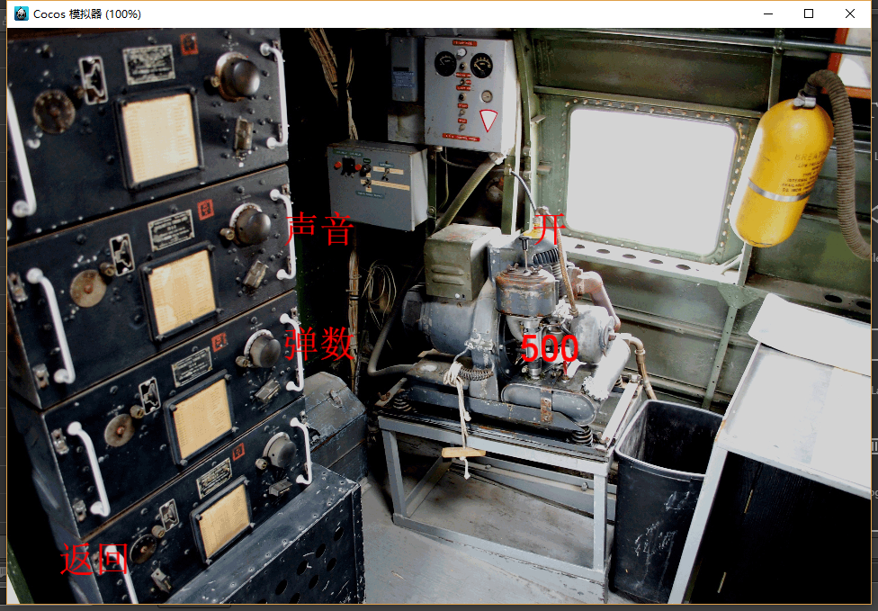

# 是男人就坚持20秒Remastered

:alarm_clock:CocosCreator v1.5.0

:alarm_clock:tsc Version 2.3.4

:alarm_clock:密集恐惧症慎用

男人就坚持20秒属于经典的弹幕游戏，做例子研究也很有价值，足够小且完整，还有相当的游戏性。这是很多Demo所不具备的。这两天用TypeScript语言Remastered了一下，之前那个是C++写的。

感觉上，CocosCreator+TypeScript写起东西来非常顺手。CocosCreator内部提供了很多成熟的快速开发功能，比起以前效率提高不少。TypeScript的各种提示识别，变量函数增删改查都很方便，完全能够抵消多出来的代码编写编译所需的时间，项目越大效果应该越明显。

用到的一些功能和写法：

- 重写摇杆算法支持全部方向
- 加入ASDW上下左右按键控制
- 空Node作为RootNode调整坐标系
- Prefab与NodePool编写子弹
- 碰撞系统
- 数据驱动方式
- 事件系统处理交互
- Global全局变量以及挂载方式
- 预先埋伏Node并隐藏
- 游戏评价用了点JavaScript语言特性
- 加入一个道具

